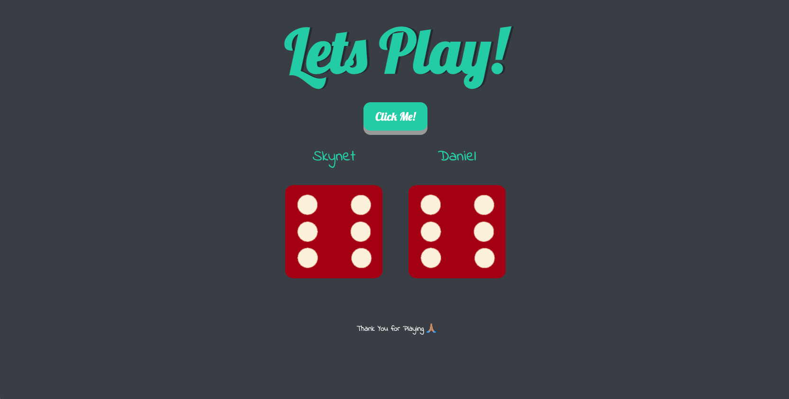

# Dice Challenge

## Description:

Welcome to The Dice Challenge! This is a simple interactive game where you get to battle the computer to who see who achieves the higher dice number. This is my first JavaScript Project which was very rewarding. The HTML and the CSS was a starter file from Udemy's "The Complete 2022 Web Development Bootcamp", taught by Dr. Angela Yu. While the project captured the foundation of JavaScript, it simply wasn’t enough to satisfy me. Therefore, I incorporated recent and pass knowledge making the game more interactive and personal! I hope you enjoy The Dice Challenge!

## What I Learned:

1. Data Types, JavaScript Variables, String Concatenation, Creating & Calling Functions, the difference between Parameters & Arguments, Outputs & Return Values, Conditional Statements & Logic, Arrays, While & For Loops.

2. How to select HTML Selectors with JavaScript, using elementsByTagName, className, byId, querySelector's, classList.add/remove, innerHTML, textContent, and using setAttribute's.

## What I Added:

1. Changed h1 from "Refresh Me" to "Let’s Play!" I wanted this game to be more interactive and inviting. I wanted more than to refresh the page to a new result.

2. When you open the link you are greeted with a prompt asking What your name is. Once you enter your name it is saved, an alert will pop up welcoming you personally to the game.

3. Your personal name is saved as player two. If you do not enter a name, "Player 2" will take the place of your name by default. You as the player will be battling the computer named, "Skynet".

4. I added a nice "Click Me!" button to begin the game.

5. Once the game begins, the outcome of game will project in an h3 that only displays once the game begins. In this h3, it will display the following: "Skynet Wins", "['Your Name'] Wins", or "Its a Draw".

Play the Dice Challenge Today! https://coderortiz.github.io/dice_challenge/

